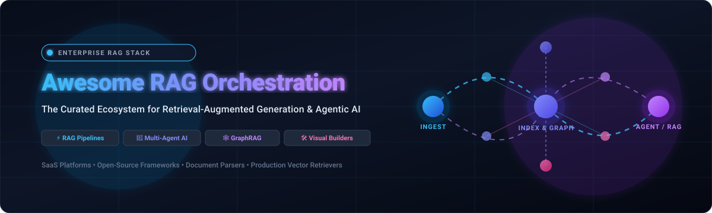

# ⚡ Awesome-RAG-Orchestration ⚡

### Curated Ecosystem of SaaS Platforms & Open-Source Tools for Retrieval-Augmented Generation & Agentic AI

  
  
  
  
  
  
  
  

  <b>Comprehensive directory of enterprise-grade RAG orchestration platforms, agentic frameworks, visual pipeline builders, document chunking parsers, and neural retrieval pipelines.</b>

  🕒 Last updated: August 2026

---

## 📖 Overview

**Retrieval-Augmented Generation (RAG)** has evolved from basic vector lookup into sophisticated multi-stage orchestration systems. Production RAG platforms coordinate complex distributed workflows including:
- 📄 **Multimodal Document Parsing & Chunking** (OCR, table extraction, metadata enrichment)
- 🧠 **Hybrid Semantic Retrieval** (Dense embeddings, BM25 sparse lexical search, knowledge graphs)
- 🎯 **Neural Reranking & Context Compression** (Cross-encoders, reciprocal rank fusion, contextual pruning)
- 🤖 **Multi-Agent Orchestration & Stateful Graphs** (Autonomous reasoning loops, tool-calling, reflection)
- 📊 **Continuous Evaluation & Observability** (Faithfulness, answer relevancy, hallucination detection)

This curated repository tracks the leading **commercial SaaS solutions** and **open-source GitHub projects** powering next-generation production AI applications.

---

## 📑 Table of Contents

- [☁️ SaaS / Hosted Platforms](#-saas--hosted-platforms)
- [💻 Open-Source GitHub Projects](#-open-source-github-projects)
- [🛠️ Framework Selection Guide](#-framework-selection-guide)
- [🤝 How to Contribute](#-how-to-contribute)
- [⚠️ Disclaimer](#-disclaimer)
- [📈 Star History](#-star-history)

---

## ☁️ SaaS / Hosted Platforms

*Commercial enterprise RAG orchestration platforms, hosted agent platforms, and managed retrieval infrastructures. Sorted by company valuation and total funding in descending order.*

| Platform / Product | Description & RAG Capabilities | Company Valuation / Size | Starting Paid Pricing | Free Tier / Free Trial Limits |
| :--- | :--- | :--- | :--- | :--- |
| **[Rivet (Ironclad)](https://rivet.ironcladapp.com/)** | Visual AI programming environment and TypeScript execution library for building, testing, and debugging complex LLM agent graphs and RAG pipelines. | **~$3.2B Valuation** ($334M raised, $200M+ ARR, Series E) | **$0 (100% Free Open-Source Desktop GUI & Library)** / Bring Your Own API Keys | **Free Forever (Open Source MIT License)**: Unlimited local workflows, unlimited graphs, complete visual debugger, no usage caps |
| **[LangChain / LangSmith](https://www.langchain.com/)** | Unified LLM application orchestration ecosystem with stateful LangGraph agent runtimes, prompt playgrounds, and LangSmith observability. | **~$1.25B Valuation** ($160M+ raised, $125M round led by IVP & Sequoia) | **$39/seat/month** (Plus tier: includes 10,000 traces/month, 400-day data retention, $2.50 per 1k additional traces) | **Free Forever (Developer plan)**: 1 user seat, 5,000 traces/month, 14-day data retention, 50,000 events/hour rate limit |
| **[Dify](https://dify.ai/)** | Visual workflow canvas and production RAG pipeline orchestrator with native dataset indexing, agentic tools, and multi-model deployment. | **~$180M Valuation** ($30M Series Pre-A funding) | **$59/month** ($49/mo billed annually for Professional plan; includes 5,000 message credits, 3 team members, 5 GB storage) | **Free Forever (Sandbox plan)**: 200 message credits, 1 team member, 5 MB vector storage, up to 10 active app instances |
| **[CrewAI](https://www.crewai.com/)** | Enterprise multi-agent orchestration platform with visual Studio editor, automated crew execution, and collaborative agent workflows. | **~$177M Valuation** ($18M Series A led by Insight Partners) | **Enterprise custom plans** (Basic Platform is $0/mo; dedicated cloud/VPC tiers via scoped proposals) | **Free Forever (Basic plan)**: 50 workflow executions/month, visual studio editor, AI Copilot, GitHub integrations |
| **[Vectara](https://vectara.com/)** | End-to-end trusted GenAI and RAG platform with built-in hybrid search, neural reranking, hallucination evaluation (HHEM), and secure enterprise indexing. | **~$120M Valuation** ($73.5M total funding raised, Series A led by Race Capital) | **$100/month** (Professional tier for production workloads; Scale enterprise tier on custom quote) | **30-Day Free Trial**: Includes 10,000 free query/generation credits, multi-lingual reranking, advanced generative models, and full platform access |
| **[LlamaIndex / LlamaCloud](https://www.llamaindex.ai/)** | Managed data framework for document ingestion, agentic parsing (LlamaParse), indexing, managed retrieval pipelines, and enterprise RAG. | **~$93M Valuation** ($27.5M total funding raised led by Norwest & Bessemer) | **$50/month** (Starter tier: includes 40,000 credits/mo; additional usage at $1.25 per 1,000 credits) | **Free Forever (Free tier)**: 10,000 credits/month, 1 user, 1 project, 5 indexes, max 10,000 files (10 GB storage), 20 req/min hard cap |
| **[Dust](https://dust.tt/)** | AI assistant and knowledge orchestration platform connecting company data sources (Notion, Slack, Google Drive) with custom RAG agents. | **~$90M Valuation** ($61.5M total funding raised, Series B led by Sequoia) | **$29/user/month** ($24/user/mo billed annually for Pro plan; includes 8,000 model credits/seat/month, custom agents, 20+ frontier models) | **15-Day Free Trial**: Full access to Pro plan features, company data connectors, multi-model execution, and credit quota (no permanent free tier) |
| **[Relevance AI](https://relevanceai.com/)** | Low-code AI workforce and multi-agent orchestration platform for building autonomous B2B agents with knowledge retrieval and tool integration. | **~$50M Valuation** ($37M total funding raised, Series B led by Bessemer) | **$29/month** ($19/mo billed annually for Pro plan; includes 2,500 actions/month and $20 vendor model credits) | **Free Forever (Free plan)**: 200 actions/month, 1 build user, 1 project, $2 one-time model credit bonus |
| **[Haystack / deepset Cloud](https://haystack.deepset.ai/)** | Enterprise NLP and RAG orchestration platform by deepset for building, deploying, monitoring, and evaluating search and QA pipelines. | **~$37M Valuation** ($46M total funding raised led by Balderton & GV) | **$0/month** (Studio tier); Enterprise managed platform starts with custom contract / AWS Marketplace unit commitments | **Free Forever (Studio plan)**: 1 workspace, 1 user, 100 pipeline hours/month, 50 files (max 10MB per file), 2 development pipelines |
| **[Fixie / Ultravox](https://www.fixie.ai/)** | Voice-native and conversational AI platform with real-time audio orchestration, tool execution, and managed RAG corpora for low-latency agent interactions. | **~$38M Valuation** ($17M seed funding led by Redpoint) | **$100/month** (Pro plan: unlimited concurrency, 5 custom voices, 20 RAG corpora; SIP at $0.048/min) or Pay-As-You-Go at $0.05/min | **Free Forever (Pay-as-you-go free starter)**: 30 minutes of free call execution, 5 concurrent calls, unlimited playground testing calls |
| **[Flowise](https://flowiseai.com/)** | Visual drag-and-drop orchestration platform for LLM chains, multi-agent flows, document loaders, vector stores, and RAG pipelines. | **~$10M Valuation** (Y Combinator W23 / Seed stage) | **$35/month** (Starter plan: unlimited flows, 10,000 predictions/month, 1 GB storage; Pro at $65/mo for 50,000 predictions/mo) | **Free Forever (Free plan)**: 2 active flows, 100 predictions/month, 5 MB storage |
| **[Ragie](https://ragie.ai/)** | Developer-first managed RAG platform providing fully hosted document ingestion, chunking, indexing, and high-precision semantic retrieval APIs. | **~$8M Valuation** ($5M Seed funding) | **$100/month** (Starter tier for production workloads with dedicated partition and higher rate limits) | **Free Forever (Developer plan)**: 1,000 indexed pages, 1,000 retrievals/month, 10 requests/minute rate limit |
| **[TurboML](https://www.turboml.com/)** | Real-time ML and streaming data orchestration platform tailored for high-throughput, low-latency feature engineering and live RAG retrieval workloads. | **~$5M Valuation** ($3M Seed funding) | **$0.01 per TurboML Unit** (AWS Marketplace contract starting tier; unit-based allocation for multi-month commitments) | **14-Day Free Trial**: Evaluation trial available upon sales/demo request for enterprise workload sizing (or $10 free compute credit on cloud instance) |

---

## 💻 Open-Source GitHub Projects

*Leading open-source frameworks, agent engines, visual builders, and RAG retrieval pipelines. Sorted by GitHub stars in descending order.*

1. **[Langflow](https://github.com/langflow-ai/langflow)**   
   ✨ Dynamic, visual framework for building multi-agent systems, RAG workflows, and LLM applications with a powerful modular canvas and Python backend.

2. **[Dify](https://github.com/langgenius/dify)**   
   🚀 Production-ready open-source LLM application development platform featuring visual orchestration, RAG pipelines, agent operations, model management, and comprehensive observability.

3. **[LangChain + LangGraph](https://github.com/langchain-ai/langchain)**   
   🦜 Industry-standard orchestration library and cyclical graph-based runtime for building stateful, multi-actor LLM applications and enterprise RAG systems.

4. **[RAGFlow](https://github.com/infiniflow/ragflow)**   
   📑 Open-source RAG engine based on deep document understanding, table recognition, visual chunking, and grounded citations for structured and unstructured data.

5. **[Mem0](https://github.com/mem0ai/mem0)**   
   🧠 Universal memory layer for AI agents and RAG applications, enabling continuous learning, personalized retrieval, and long-term user context retention.

6. **[Flowise](https://github.com/FlowiseAI/Flowise)**   
   🎨 Drag-and-drop user interface for composing LLM chains, agentic flows, custom tools, and RAG pipelines in Node.js and TypeScript.

7. **[CrewAI](https://github.com/crewAIInc/crewAI)**   
   👥 Framework for orchestrating role-playing, autonomous AI agents that collaborate seamlessly on complex problem-solving and knowledge retrieval tasks.

8. **[LlamaIndex](https://github.com/run-llama/llama_index)**   
   🦙 Premier data framework for connecting custom enterprise data sources to LLMs, featuring advanced document loaders, structured indexes, query routers, and agentic retrieval.

9. **[AutoGen / AG2](https://github.com/microsoft/autogen)**   
   🤖 Framework for enabling next-generation multi-agent conversation systems, tool execution, human-in-the-loop interactions, and collaborative RAG.

10. **[LightRAG](https://github.com/HKUDS/LightRAG)**   
    ⚡ Simple and fast dual-level Retrieval-Augmented Generation system optimizing both low-level specific entity retrieval and high-level abstract conceptual summarization.

11. **[DSPy](https://github.com/stanfordnlp/dspy)**   
    🔬 Stanford framework for algorithmically optimizing LLM prompts, few-shot demonstrations, and RAG retrieval weights as declarative code modules.

12. **[FastGPT](https://github.com/labring/FastGPT)**   
    ⚡ Knowledge-base platform built on LLMs with visual workflow orchestration, automated data preprocessing, vector search, and multi-tenant management.

13. **[Haystack](https://github.com/deepset-ai/haystack)**   
    🌾 Modular, production-ready Python framework from deepset for constructing customizable search pipelines, question answering, and end-to-end RAG workflows.

14. **[Kotaemon](https://github.com/Cinnamon/kotaemon)**   
    🔍 Open-source, clean, and customizable RAG UI and backend framework designed for deep document QA, multi-modal reasoning, and complex legal/technical document retrieval.

15. **[Semantic Kernel](https://github.com/microsoft/semantic-kernel)**   
    ⚙️ Microsoft enterprise SDK for integrating conventional code with LLM AI services, plugins, planners, memories, and multi-agent vector pipelines.

16. **[Ragas](https://github.com/explodinggradients/ragas)**   
    📊 Framework for automated, reference-free evaluation of Retrieval-Augmented Generation pipelines (faithfulness, answer relevancy, context precision, and context recall).

17. **[txtai](https://github.com/neuml/txtai)**   
    💡 All-in-one embeddings database for semantic search, LLM orchestration, knowledge graphs, and multimodal workflow automation.

18. **[Rivet](https://github.com/Ironclad/rivet)**   
    🛠️ Visual AI programming environment and TypeScript library developed by Ironclad for building, testing, and debugging complex LLM agent graphs and RAG pipelines.

19. **[Verba](https://github.com/weaviate/Verba)**   
    💬 Open-source, golden-standard RAG application powered by Weaviate, featuring semantic search, hybrid chunking, and instant document exploration.

20. **[Ragna](https://github.com/Quansight/ragna)**   
    🧩 Open-source RAG orchestration framework by Quansight providing intuitive Python and REST APIs alongside a web UI for document-based question answering.

---

## 🛠️ Framework Selection Guide

| Architectural Goal | Recommended Stack | Key Rationale |
| :--- | :--- | :--- |
| **Document-Heavy & Parsing-Centric** | **LlamaIndex** + **LlamaParse** | Superior handling of complex tables, unstructured PDFs, hierarchical chunking, and metadata indices. |
| **Visual Workflow & Low-Code Prototyping** | **Langflow** or **Dify** | Intuitive visual nodes, fast pipeline iteration, built-in model providers, and rapid team collaboration. |
| **Multi-Agent Collaborative Workflows** | **LangGraph** or **CrewAI** | Robust state machines, role-playing agents, tool delegation, cyclic loops, and checkpointing. |
| **Production Enterprise Search & QA** | **Haystack** | Clean pipeline architecture, high test coverage, serialized component graphs, and production readiness. |
| **Graph-Enhanced Retrieval (GraphRAG)** | **LightRAG** or **Mem0** | Dynamic entity linking, relationship-aware retrieval, dual-level abstraction, and persistent memory. |
| **Automated Prompt & Retrieval Tuning** | **DSPy** + **Ragas** | Programmatic prompt optimization, automated teleprompters, and continuous metrics-driven evaluation. |

---

## 🤝 How to Contribute

Contributions are warmly welcomed! To suggest a new tool or platform:

1. 🍴 **Fork the repository**.
2. 📝 **Add or update the entry** in `README.md` maintaining the existing schema, sorting criteria, and specific pricing/star badges.
3. 🔗 **Include accurate links**, factual description, and company size/pricing details.
4. 🚀 **Submit a Pull Request** with a concise explanation.

⭐ **Star the repo if you find it helpful!**

---

## ⚠️ Disclaimer

- This is a **community-curated index** for informational purposes — not an official endorsement.
- Retrieval-Augmented Generation systems interact with sensitive enterprise databases and user queries. Ensure thorough implementation of data privacy, access controls, prompt sanitization, and evaluation metrics before deploying to production.
- Pricing, API quotas, and framework versions evolve rapidly; always verify latest parameters with official vendor documentation.

---

  <b>Built for AI engineers, knowledge architects, and teams delivering grounded, production-grade LLM applications.</b> 
  <i>Let's make RAG orchestration more modular, resilient, and open.</i>

## 📈 Star History

